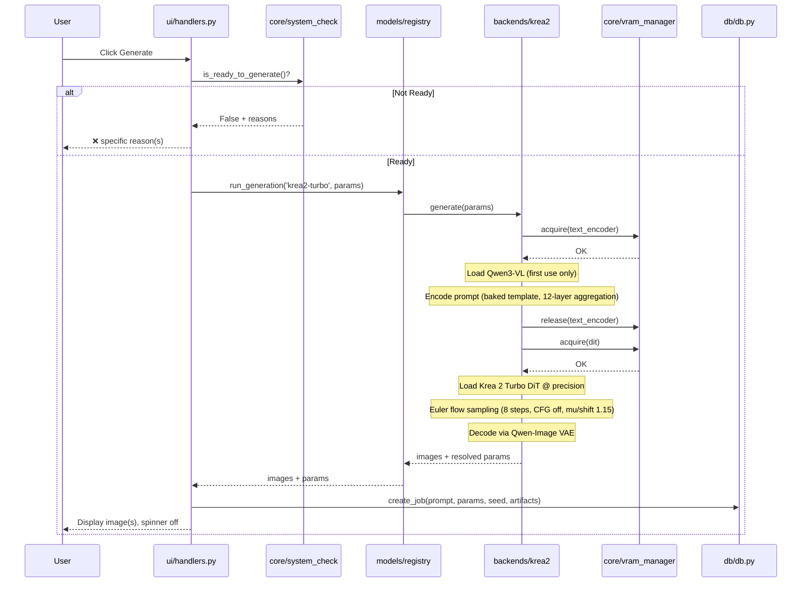
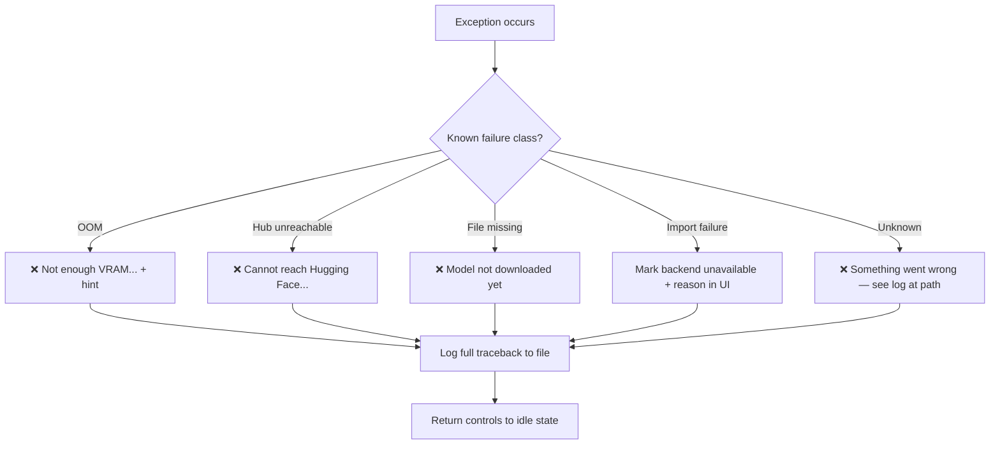

# Design Document

## Overview

Cinderworks Phase 1 implements the core creative loop: download Krea 2 Turbo, generate an image, persist the job/params/result, and recall history. The architecture is a single-process Gradio app with a thin shell and clear module seams, derived from the proven BeatBunny/Higgs Studio template.

The design is governed by the product thesis — "Works when you log in. Still works tomorrow." — and reuses hard-won, test-driven patterns from the owner's prior projects rather than reinventing them.

**Design rule:** Where this document and the patterns steering doc describe the same thing, the patterns doc's "source to mirror" wins. Consult the BeatBunny source before implementing the corresponding module.

## Architecture

### High-Level Architecture

A single-process Gradio app with layered responsibilities:

```
┌─────────────────────────────────────────────────────────────┐
│  app.py  (Gradio Blocks shell — tabs, wiring only)          │
│  Tabs: Generate │ History │ Models │ Settings               │
└───────────────┬─────────────────────────────────────────────┘
                │  calls
        ┌───────▼────────┐   ui/handlers.py  (try/except → plain text)
        │  ui/           │   ui/controls.py  (param + batch controls)
        │  handlers,     │   ui/theme.py     (glassmorphism CSS)
        │  controls,     │
        │  theme         │
        └───────┬────────┘
                │  delegates to
   ┌────────────▼────────────────────────────────────────────┐
   │  core/                models/                 db/        │
   │  system_check    ┌─►  registry ──► backends/   db.py     │
   │  model_loader    │    downloader     krea2.py            │
   │  vram_manager ◄──┘                    │                  │
   │      ▲───────────────────────────────┘ (all GPU moves)  │
   └─────────────────────────────────────────────────────────┘
```

### Key Architectural Invariants

1. **Shell stays thin** — `app.py` wires Gradio components to handlers. No inference, no download, no SQL in `app.py`.
2. **Registry indirection** — the shell never imports `backends/krea2.py` directly; all access goes through `models/registry.py`.
3. **Single GPU chokepoint** — only `core/vram_manager.py` moves anything on/off the GPU. Nothing else calls `.to('cuda')` / `.to('cpu')`.
4. **Single DB chokepoint** — only `db/db.py` touches SQLite. Handlers call db functions; they don't write SQL inline.
5. **Error boundary at UI layer** — handlers catch, log, and return `❌ <plain language>` strings. Tracebacks go to the log file, never the user's screen.

### Generation Flow (Sequence Diagram)



## Components and Interfaces

### `app.py` — Shell
**Implements:** Requirements 1, 2, 10 (fast startup, tabbed layout)

Builds `gr.Blocks` with the glassmorphism theme from `ui/theme.py` and four tabs (Generate, History, Models, Settings). Wires component events to functions in `ui/handlers.py`. Holds no logic. On load, calls `core.system_check.get_readiness_banner()` to set the initial banner state.

### `ui/handlers.py` — Error Boundary and Event Handlers
**Implements:** Requirements 4, 5, 8, 11 (error surfacing, generation orchestration, persistence trigger, graceful degradation)

One handler per user action (download, generate, open-history, load-params). Each is wrapped in try/except that catches, logs, and returns plain text:

```python
def on_generate(...):
    try:
        yield spinner_on()
        for update in run_generation(...):
            yield update
    except Exception as e:
        log.exception("generate failed")
        yield error_text(f"❌ {friendly(e)}"), spinner_off()
```

`friendly()` maps known failure classes (OOM, missing file, hub unreachable) to plain sentences; unknown errors get a generic "something went wrong — see log" plus the log path.

### `ui/controls.py` — Parameter Surface
**Implements:** Requirements 5, 6 (sampler params, batch controls)

Reusable control groups:
- Prompt box
- Sampler params: steps (1–100), seed (0–2³²-1), width (512–2048, multiples of 64), height (512–2048, multiples of 64) with Turbo defaults pre-filled
- Precision picker: bf16 / fp8_scaled
- Batch_Size (1–16) and Batch_Count (1–100) as distinct controls with tooltips explaining size=simultaneous/VRAM-bound vs count=sequential/queue-bound
- Krea's internal prompt template is NOT surfaced as an editable field

### `ui/theme.py` — Glassmorphism CSS
**Implements:** Visual design (non-functional)

Animated multi-stop gradient background; `.glass-panel` with `backdrop-filter: blur(16px)`, translucent white borders; forced light text for contrast. Lemon/amber accent palette. Sourced from BeatBunny `CUSTOM_CSS` block.

### `core/system_check.py` — Readiness
**Implements:** Requirements 1, 3, 4 (CUDA detection, model presence, readiness banner)

Pure functions mirroring BeatBunny `worker/system_check.py`:
- `check_cuda_status() → bool` — detects CUDA availability
- `check_model_status() → dict[str, bool]` — duck-typed presence + size sanity for each model file (partial file = not present per R3.6)
- `is_ready_to_generate() → bool` — True only when CUDA + all three files present and size-valid
- `get_system_status_text() → str` — plain-language summary of all conditions
- `get_readiness_banner() → GradioUpdate` — shows banner with all unmet conditions, hides when ready

### `core/model_loader.py` — Lazy Loading
**Implements:** Requirement 2 (fast startup, lazy load)

Loads model components only on first generate. Caches loaded components keyed by `(model_id, precision)`. Delegates actual GPU placement to `vram_manager`. Importing this module must not touch CUDA or trigger weight loading.

### `core/vram_manager.py` — Tenant Discipline
**Implements:** Requirement 7 (VRAM management, tenant coordination)

Central coordinator with `acquire(tenant)` / `release(tenant)` API. Enforces one heavyweight tenant resident at a time (Phase 1). Built with a real tenant interface so Phase 3/4 tenants (prompt LLM, trainer subprocess) slot in unchanged.

Interface:
```python
class VRAMManager:
    def acquire(self, tenant: Tenant) -> None:
        """Load tenant to GPU. Unloads existing if one is resident."""
    def release(self, tenant: Tenant) -> None:
        """Move tenant back to CPU, free GPU memory."""
    def estimate_available(self) -> int:
        """Estimated free VRAM in bytes."""
    def can_fit(self, bytes_needed: int) -> bool:
        """Pre-check whether a batch would fit."""
```

### `models/registry.py` — Model-Agnostic Seam
**Implements:** Requirement 9 (registry routing, lazy import, graceful backend failure)

Holds registry entries and resolves a `model_id` to its backend module, metadata, and defaults. Public surface:
- `list_models() → list[ModelMeta]`
- `get_meta(model_id) → ModelMeta`
- `run_generation(model_id, params) → Generator[ProgressUpdate | FinalResult]`

Backend import is lazy and guarded: a failing backend is recorded as unavailable-with-reason and does not propagate. Phase 1: exactly one entry (Krea 2 Turbo), no stubs.

Registry entry shape:
```python
@dataclass
class RegistryEntry:
    model_id: str              # 'krea2-turbo'
    display_name: str
    backend_module: str        # 'models.backends.krea2'
    checkpoints: list[str]     # filenames
    vae: str
    text_encoder: str
    sampler_defaults: dict     # steps, cfg, mu_shift
    precision_options: list[str]  # ['bf16', 'fp8_scaled']
    vram_tiers: dict[str, int]   # precision → estimated bytes
```

### `models/downloader.py` — Streaming Downloader
**Implements:** Requirement 3 (download, resume, auto-place, progress)

Mirrors BeatBunny `worker/model_downloader.py`. A generator yielding progress strings; resumable via `huggingface_hub`; auto-places files into correct `MODEL_DIR` subfolders:
- `download_all_models_generator(model_id) → Generator[str]` — yields progress per chunk
- `get_model_info_text(model_id) → str`
- `get_download_state(model_id) → dict[str, str]` — per-file status
- `check_huggingface_hub() → bool` — hub reachability check

### `models/backends/krea2.py` — Krea 2 Turbo Backend
**Implements:** Requirements 5, 7 (generation sequence, VRAM discipline)

Implements the load→encode→offload→load→sample→decode sequence using `vram_manager` for every GPU move:

1. `vram_manager.acquire(text_encoder)` → load Qwen3-VL-4B
2. Wrap prompt in Krea's baked template; encode; aggregate 12 selected hidden-state layers
3. `vram_manager.release(text_encoder)`
4. `vram_manager.acquire(dit)` → load Krea 2 Turbo DiT at chosen precision
5. Euler flow sampling: 8 steps, CFG 1.0 (disabled), fixed mu/shift 1.15 (Turbo defaults). Batch image *i* uses `seed + i`
6. Decode via Qwen-Image VAE (tiled decode option for headroom)

Returns images + resolved params (including actual seed) for persistence.

### `db/db.py` — Persistence
**Implements:** Requirement 8 (job storage, history, reproducibility)

Plain `sqlite3`, no ORM. Mirrors BeatBunny `db/db.py`:
- `init_db()` — creates tables if not exist
- `create_job(prompt, params_json, seed, model_id, duration_ms, status, artifacts) → job_id`
- `get_recent_jobs(limit=20, offset=0) → list[JobSummary]` — paged, ordered by created_at DESC
- `get_job(job_id) → Job`
- `get_job_artifacts(job_id) → list[Artifact]`

## Data Models

### Database Schema

```sql
CREATE TABLE job (
    id            INTEGER PRIMARY KEY AUTOINCREMENT,
    created_at    TEXT NOT NULL,          -- ISO8601
    model_id      TEXT NOT NULL,          -- 'krea2-turbo'
    prompt        TEXT NOT NULL,
    params_json   TEXT NOT NULL,          -- JSON: {steps, cfg, mu_shift, width, height,
                                         --        precision, batch_size, batch_count}
    seed          INTEGER NOT NULL,       -- the actual base seed used
    duration_ms   INTEGER,
    status        TEXT NOT NULL           -- 'complete' | 'failed'
);

CREATE TABLE artifact (
    id            INTEGER PRIMARY KEY AUTOINCREMENT,
    job_id        INTEGER NOT NULL REFERENCES job(id),
    path          TEXT NOT NULL,          -- outputs/job_<id>/<n>.png
    seed          INTEGER NOT NULL,       -- per-image seed (base_seed + i)
    width         INTEGER,
    height        INTEGER
);
```

### In-Memory Models

```python
@dataclass
class GenerationParams:
    prompt: str
    steps: int = 8            # Turbo default
    cfg: float = 1.0          # disabled for Turbo
    mu_shift: float = 1.15    # fixed for Turbo
    width: int = 1024
    height: int = 1024
    precision: str = 'bf16'
    batch_size: int = 1
    batch_count: int = 1
    seed: int | None = None   # None = generate random

@dataclass
class JobResult:
    job_id: int
    images: list[Path]
    seed: int                  # actual seed used
    duration_ms: int
    params: GenerationParams

@dataclass
class Tenant:
    name: str                  # 'text_encoder', 'dit'
    estimated_bytes: int       # VRAM footprint
    load_fn: Callable         # called on acquire
    unload_fn: Callable       # called on release
```

### Krea 2 Model Files (from Comfy-Org/Krea-2)

| Component | Filename | Size (approx) | Precision |
|-----------|----------|---------------|-----------|
| Diffusion DiT (Turbo) | `krea2_turbo_fp8_scaled.safetensors` | ~13 GB | fp8_scaled |
| Diffusion DiT (Turbo) | `krea2_turbo_bf16.safetensors` | ~25 GB | bf16 |
| Text Encoder | `qwen3vl_4b_fp8_scaled.safetensors` | ~4 GB | fp8_scaled |
| VAE | `qwen_image_vae.safetensors` | ~0.5 GB | — |


## Correctness Properties

*A property is a characteristic or behavior that should hold true across all valid executions of a system — essentially, a formal statement about what the system should do. Properties serve as the bridge between human-readable specifications and machine-verifiable correctness guarantees.*

### Property 1: Download progress contains required information

*For any* model file with known metadata (filename, total bytes), every progress string yielded by the downloader during transfer SHALL contain the current filename, a percentage value, and the bytes-downloaded-vs-total representation.

**Validates: Requirements 3.1**

### Property 2: Download resumes from interruption point

*For any* file download interrupted at byte offset N (where 0 < N < total_bytes), re-triggering the download SHALL resume from byte N rather than byte 0, resulting in only (total_bytes - N) additional bytes transferred.

**Validates: Requirements 3.2**

### Property 3: Size mismatch means not-present

*For any* model file where the on-disk size differs from the expected size in Hugging Face repository metadata, the system SHALL treat that file as not-present for readiness evaluation purposes.

**Validates: Requirements 3.6**

### Property 4: Partial download failure identifies exactly the failed files

*For any* multi-file download where a subset of files fail, the failure report SHALL name exactly the files that failed (no more, no less), and all successfully downloaded files SHALL be retained on disk.

**Validates: Requirements 3.7**

### Property 5: Download yields progress at least once per chunk

*For any* download receiving N chunks, the downloader generator SHALL yield at least N progress updates so the UI observes forward movement per received chunk.

**Validates: Requirements 3.8**

### Property 6: Readiness reports all unmet conditions

*For any* combination of system conditions (CUDA present/absent, each of the three model files present/absent with valid size), the readiness check SHALL report every currently unmet condition in its output — never omitting one that is actually unmet, and never including one that is actually met.

**Validates: Requirements 4.1, 4.4**

### Property 7: Error handler produces plain-language output without tracebacks

*For any* exception raised within a handler, the `friendly()` error mapping SHALL produce a string that contains a plain-language description of the failure category, includes the log file path, and does NOT contain Python traceback frames or raw exception class names visible to the user.

**Validates: Requirements 4.5**

### Property 8: Sampler parameters default to Turbo unless explicitly overridden

*For any* subset of sampler parameters provided by the user, omitted parameters SHALL use Turbo_Defaults (steps=8, cfg=1.0, mu_shift=1.15), and provided parameters SHALL use the user-supplied values exactly.

**Validates: Requirements 5.2**

### Property 9: Seed determinism

*For any* generation request where a seed is explicitly provided, that exact seed SHALL be used. *For any* generation request where no seed is provided, a random seed SHALL be generated, recorded in the Job, and used — such that the Job record alone is sufficient to reproduce the seed used.

**Validates: Requirements 5.4**

### Property 10: Parameter bounds validation

*For any* parameter value, the system SHALL accept it if and only if it falls within the defined bounds (steps: 1–100, seed: 0–2³²-1, width: 512–2048 in multiples of 64, height: 512–2048 in multiples of 64, batch_size: 1–16, batch_count: 1–100) and reject out-of-bounds values with a specific validation message.

**Validates: Requirements 5.5**

### Property 11: Batch produces correct image count with correct per-image seeds

*For any* (batch_size, batch_count, base_seed) tuple where batch_size ∈ [1,16] and batch_count ∈ [1,100], the system SHALL produce exactly batch_size × batch_count images, and image *i* within each batch SHALL use seed value (base_seed + i).

**Validates: Requirements 6.1, 6.2**

### Property 12: VRAM manager refuses batch exceeding estimated capacity

*For any* batch_size whose estimated VRAM requirement (batch_size × per_image_footprint) exceeds the VRAM_Manager's estimated available memory, the system SHALL refuse the generation with a plain-language message before any inference work begins.

**Validates: Requirements 6.4**

### Property 13: OOM during batch preserves prior completed batches

*For any* batch sequence where an out-of-memory error occurs at batch K (K > 1), all images produced by batches 1 through K-1 SHALL be preserved on disk and in the output, and the failure SHALL be reported in plain language.

**Validates: Requirements 6.5**

### Property 14: Tenant discipline — acquire unloads existing resident

*For any* sequence of tenant acquisitions, acquiring tenant B while tenant A is resident SHALL unload A (releasing its GPU memory) before B is loaded. At no point SHALL two heavyweight tenants be simultaneously GPU-resident.

**Validates: Requirements 7.2, 7.3**

### Property 15: Job persistence round-trip

*For any* valid job data (prompt, params_json, seed, model_id, duration_ms, status, artifact paths), persisting the job to the database and reading it back SHALL return data identical to what was written — no field loss, no truncation, no type coercion that changes values.

**Validates: Requirements 8.1**

### Property 16: History listing ordered by creation time descending

*For any* set of N jobs with distinct creation timestamps, `get_recent_jobs` SHALL return them in strictly descending creation-time order, with prompts truncated to 120 characters.

**Validates: Requirements 8.3**

### Property 17: Job params reload populates generation fields exactly

*For any* past Job, loading its parameters into the Generate tab SHALL populate prompt, seed, steps, width, height, precision, batch_size, and batch_count with the stored values exactly, without triggering a generation.

**Validates: Requirements 8.4**

### Property 18: History paging returns correct page sizes

*For any* total job count N, requesting page P of size 20 SHALL return min(20, N - P×20) jobs (or 0 if P×20 ≥ N), and SHALL not load all rows into memory.

**Validates: Requirements 8.5**

### Property 19: Backend unavailability reason round-trip

*For any* exception that occurs during backend import, the registry SHALL store the exception's plain-language description as the unavailability reason, and *for any* subsequent generation request against that backend, the system SHALL return that exact recorded reason without re-attempting the import.

**Validates: Requirements 9.3, 9.4**

### Property 20: Graceful degradation preserves app state on failure

*For any* failure occurring in the downloader, a model backend, or during a generation, the application SHALL remain running and responsive, the failure SHALL be surfaced as a plain-language string in the UI (not a traceback), and all previously persisted jobs SHALL remain intact and accessible.

**Validates: Requirements 11.1, 11.3**

## Error Handling

### Strategy: Pre-checked Readiness + Plain-Language Boundary

All errors are caught at the `ui/handlers.py` boundary and translated to plain text. The user never sees a traceback.

| Failure Mode | Response | Requirement |
|---|---|---|
| Not Ready_to_Generate | Pre-checked; generate refused with specific unmet condition(s) in `❌` message | R4.4 |
| Hub unreachable (download) | Reported as plain-language string, no throw, UI remains responsive | R3.4 |
| OOM during generation | `vram_manager` attempts unload+retry once; if still OOM: "❌ Not enough VRAM — try lowering batch size or switching to fp8_scaled" | R6.5, R7.5 |
| Missing/partial model file | Treated as not-ready by `check_model_status`; banner says "model not downloaded yet" | R3.6, R4.1 |
| Backend import failure | Registry marks backend unavailable-with-reason; app keeps running; reason shown in UI | R9.3 |
| DB write failure | Error surfaced in UI; generated image retained on disk; generation result not discarded | R8.2 |
| Unknown exception | "❌ Something went wrong — see log at {path}" + full traceback logged to file | R4.5, R11.1 |

### Error Flow



## Testing Strategy

### Approach: Dual Testing (Unit + Property-Based)

- **Property-based tests** (via `hypothesis` library): verify universal properties across randomized inputs. Minimum 100 iterations per property test.
- **Unit tests** (pytest): verify specific examples, edge cases, integration points, and error conditions.
- Both are complementary: property tests catch general correctness regressions across the input space; unit tests pin specific behaviors and edge cases.

### Property-Based Testing Configuration

- Library: **Hypothesis** (Python's standard PBT library)
- Minimum iterations: 100 per property (via `@settings(max_examples=100)`)
- Each property test is tagged with a comment referencing its design property:
  ```python
  # Feature: cinderworks, Property 14: Tenant discipline — acquire unloads existing resident
  ```

### Test Modules and Coverage

| Module | Test File | Property Tests | Unit/Example Tests |
|--------|-----------|----------------|-------------------|
| `models/downloader.py` | `tests/test_downloader.py` | Properties 1–5 (progress format, resume, size mismatch, partial failure, chunk yields) | Hub unreachable returns string not exception; already-present detection; auto-placement of 3 files |
| `core/system_check.py` | `tests/test_system_check.py` | Property 6 (all unmet conditions reported) | Ready only when CUDA + all 3 files present and size-valid; every not-ready reason is a specific sentence |
| `ui/handlers.py` | `tests/test_handlers.py` | Properties 7, 20 (error mapping, graceful degradation) | Spinner on/off; empty prompt refused; handler never re-raises to Gradio |
| `models/backends/krea2.py` | `tests/test_krea2_backend.py` | Properties 8, 9, 10, 11 (defaults, seed, bounds, batch) | Encode→offload→sample→decode order via mocked harness; Turbo defaults applied when params omitted |
| `core/vram_manager.py` | `tests/test_vram_manager.py` | Properties 12, 13, 14 (VRAM refusal, OOM preservation, tenant discipline) | Encoder released before DiT (mock allocation tracking); acquire failure → plain-language OOM |
| `db/db.py` | `tests/test_db.py` | Properties 15, 16, 17, 18 (round-trip, ordering, reload, paging) | DB write failure handled; missing image → placeholder; paging does not SELECT all |
| `models/registry.py` | `tests/test_registry.py` | Property 19 (unavailability round-trip) | Shell never imports backend directly; failing backend marked unavailable, app still constructs; exactly 1 entry in Phase 1 |

### Integration Smoke Test (Manual, Gated)

Real download of Krea 2 Turbo fp8 → one generation → job appears in History → params reload → re-generate reproduces. This is the Phase 1 success gate from `product.md`.

### What Is NOT Tested via PBT

- UI visual appearance (glassmorphism CSS) — manual/visual only
- Startup performance (< 5 seconds) — smoke test with timing assertion
- Bit-identical reproducibility (R12) — requires real model inference; integration test only
- Platform path compatibility (R14) — CI runs on both Windows and Linux
