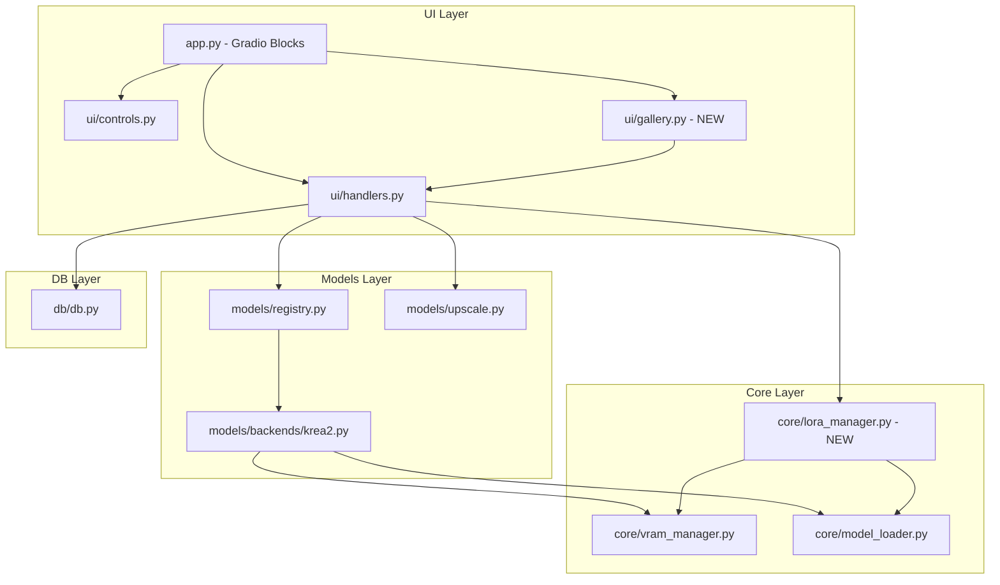

# Design — M1 Generation Completeness

## Overview

M1 extends Cinderworks Studio with five generation-time features that close the gap with Forge Neo: multi-LoRA stacking, model checkpoint selection, image-to-image with inpainting, one-click upscaling from the gallery, and keyboard navigation for the gallery. All features build on the Phase 1 architecture — the registry routing layer, VRAM tenant discipline, lazy model loading, and SQLite persistence — without rewriting any existing module.

The design follows the same layering:
- **UI layer** (`app.py`, `ui/`) — new controls and tabs; never touches CUDA directly.
- **Core layer** (`core/`) — LoRA loading, checkpoint switching, VRAM coordination.
- **Models layer** (`models/`) — registry expansion, img2img pipeline logic, updated backends.
- **DB layer** (`db/`) — schema additions for img2img params and artifacts.

Each new feature integrates through the existing `registry.run_generation()` → `backend.generate()` call path. LoRA management and checkpoint switching are orchestrated by a new `core/lora_manager.py` module that coordinates with the existing `VRAMManager`.

## Architecture



### Key Architectural Decisions

1. **LoRA loading is per-generation, not persistent.** LoRAs are applied fresh before each sampling run and unloaded after. This avoids accumulating weight drift across generations and keeps the base checkpoint clean for the next run.

2. **Checkpoint selection is lazy-switch.** Selecting a new checkpoint in the UI does NOT trigger a reload. The switch happens on the next generation request, which unloads the old checkpoint and loads the new one through the existing VRAM tenant discipline.

3. **Img2img reuses the txt2img pipeline.** The Krea2Pipeline already supports latent initialization — img2img passes the encoded init image as `latents` with noise added at the denoise_strength level. No separate pipeline class is needed.

4. **Inpainting is mask-composite post-processing.** After img2img generation, the unmasked region is composited back from the original image pixel-for-pixel. This avoids needing a separate inpainting model and works with both Raw and Turbo checkpoints.

5. **Gallery keyboard navigation is client-side JavaScript.** Gradio's Gallery component supports custom JS event listeners. Navigation state is managed in the browser, not the Python backend, for zero-latency response.

## Components and Interfaces

### core/lora_manager.py (NEW)

Manages LoRA discovery, validation, and application to the pipeline.

```python
@dataclass
class LoRAEntry:
    """A single LoRA in the stack."""
    file_path: Path       # Absolute path to .safetensors file
    filename: str         # Display name (stem of the file)
    weight: float         # 0.0–2.0, default 1.0

@dataclass
class LoRAStack:
    """Ordered list of LoRA entries for a generation."""
    entries: list[LoRAEntry]

def scan_loras(loras_dir: Path) -> list[str]:
    """Scan directory for .safetensors files. Returns display names.
    Creates directory if missing. Skips invalid files with warning."""

def validate_lora_file(file_path: Path) -> bool:
    """Check .safetensors header is parseable. Returns False on corruption."""

def apply_loras(pipeline: Any, stack: LoRAStack) -> None:
    """Apply LoRA stack to pipeline in order using diffusers load_lora_weights.
    Raises RuntimeError with plain-language message if any LoRA fails."""

def unload_loras(pipeline: Any) -> None:
    """Remove all LoRA weights from pipeline, restoring base model."""
```

**Integration with VRAM:** LoRA application happens AFTER the diffusion model tenant is acquired on GPU and BEFORE sampling. The LoRA weights are small (~100-500 MB each) and are loaded into the already-resident pipeline — no separate tenant needed. The VRAM manager's `can_fit()` is called with a combined estimate (base model + sum of LoRA weights) before generation begins.

### models/registry.py (EXTENDED)

The registry gains a second entry for Krea 2 Raw and a public API for listing all checkpoint options:

```python
# New entry added to _REGISTRY
RegistryEntry(
    model_id="krea2-raw",
    display_name="Krea 2 Raw",
    backend_module="studio.models.backends.krea2",
    checkpoints=["krea2_raw_fp8_scaled.safetensors", "krea2_raw_bf16.safetensors"],
    vae="qwen_image_vae.safetensors",
    text_encoder="qwen3vl_4b_fp8_scaled.safetensors",
    sampler_defaults={"steps": 28, "cfg": 4.5, "mu_shift": 1.15},
    precision_options=["bf16", "fp8_scaled"],
    vram_tiers={"bf16": 25_000_000_000, "fp8_scaled": 13_000_000_000},
)

def list_checkpoint_options() -> list[dict[str, str]]:
    """Return all model+precision combinations for the checkpoint selector.
    Each dict: {model_id, precision, display_label}."""
```

### models/backends/krea2.py (EXTENDED)

The backend gains img2img support:

```python
def generate(params: dict[str, Any]) -> Generator[str | dict, None, None]:
    """Extended to handle:
    - params["init_image_path"]: triggers img2img mode
    - params["denoise_strength"]: controls noise level (0.0–1.0)
    - params["mask_path"]: triggers inpainting (composite after generation)
    - params["lora_stack"]: list of {path, weight} dicts
    - params["model_id"]: selects which checkpoint to load
    """
```

The pipeline loading function `_get_pipeline` is extended to accept a `model_id` parameter and cache pipelines per `(model_id, precision, mode)`. Switching checkpoints evicts the prior cached pipeline.

### ui/controls.py (EXTENDED)

New control builders:

```python
def create_lora_panel() -> tuple[gr.Dropdown, gr.Slider, gr.Button, gr.Dataframe]:
    """LoRA panel: dropdown (available), weight slider, add button, stack display."""

def create_checkpoint_selector() -> gr.Dropdown:
    """Checkpoint dropdown populated from registry.list_checkpoint_options()."""

def create_img2img_controls() -> tuple[gr.Image, gr.Slider, gr.ImageEditor]:
    """Init image upload, denoise slider (0.0–1.0, step 0.05), mask editor."""
```

### ui/gallery.py (NEW)

Gallery component with keyboard navigation and send-to actions:

```python
def create_gallery_with_actions() -> tuple[gr.Gallery, gr.Row]:
    """Gallery with 'Send to img2img' and 'Send to Upscale' buttons.
    Includes keyboard navigation JS for left/right arrow keys."""

GALLERY_KEYBOARD_JS = """
// Injected as elem_classes + Gradio JS callback
// Handles: ArrowLeft, ArrowRight navigation
// Boundary behavior: clamp (no wrap-around)
// Focus indicator: 2px solid accent border on focused thumbnail
"""
```

### ui/handlers.py (EXTENDED)

New handlers:

```python
def on_generate_img2img(prompt, steps, seed, width, height, precision,
                        init_image, denoise_strength, mask_data,
                        lora_stack_json, checkpoint_id) -> Generator:
    """Img2img generation with optional mask. Same error-boundary pattern."""

def on_send_to_img2img(gallery_selection) -> tuple:
    """Extract selected image path, return it for the img2img init image component."""

def on_send_to_upscale(gallery_selection) -> Generator:
    """Submit selected image directly to upscaler pipeline."""

def on_refresh_loras() -> list[str]:
    """Rescan loras directory, return updated dropdown choices."""

def on_add_lora(lora_name, current_stack_json) -> str:
    """Add LoRA to stack (reject duplicates). Return updated stack JSON."""

def on_remove_lora(lora_name, current_stack_json) -> str:
    """Remove LoRA from stack. Return updated stack JSON."""
```

### db/db.py (EXTENDED)

Schema additions for img2img and upscale tracking:

```sql
-- params_json already stores arbitrary JSON, so img2img params
-- (init_image_path, denoise_strength, mask_path, lora_stack, model_id+precision)
-- are stored there. No new columns needed on the job table.

-- New: link upscaled artifacts back to their source job
ALTER TABLE artifact ADD COLUMN artifact_type TEXT DEFAULT 'generated';
-- artifact_type: 'generated' | 'upscaled'
ALTER TABLE artifact ADD COLUMN source_artifact_id INTEGER REFERENCES artifact(id);
```

## Data Models

### LoRA Stack (stored in params_json)

```json
{
  "lora_stack": [
    {"path": "studio/loras/style_anime.safetensors", "weight": 0.8},
    {"path": "studio/loras/subject_character.safetensors", "weight": 1.0}
  ]
}
```

### Img2Img Job params_json

```json
{
  "prompt": "a sunset over mountains",
  "steps": 28,
  "seed": 42,
  "width": 1024,
  "height": 1024,
  "precision": "fp8_scaled",
  "model_id": "krea2-raw",
  "denoise_strength": 0.65,
  "init_image_path": "studio/outputs/krea2_12345/img_0.png",
  "mask_path": "studio/outputs/krea2_12345/mask_0.png",
  "lora_stack": [
    {"path": "studio/loras/style_painterly.safetensors", "weight": 1.2}
  ]
}
```

### Checkpoint Selection (stored in params_json)

```json
{
  "model_id": "krea2-turbo",
  "precision": "fp8_scaled"
}
```

### Gallery State (client-side only)

```typescript
// Managed in browser JS, not persisted
interface GalleryState {
  focusedIndex: number;    // -1 if none focused
  totalImages: number;
  imageElements: HTMLElement[];
}
```

## Correctness Properties

*A property is a characteristic or behavior that should hold true across all valid executions of a system — essentially, a formal statement about what the system should do. Properties serve as the bridge between human-readable specifications and machine-verifiable correctness guarantees.*

### Property 1: LoRA scan returns exactly the valid safetensors files

*For any* directory containing a mix of files with various extensions and validity states, `scan_loras()` SHALL return exactly those files that (a) have a `.safetensors` extension AND (b) pass header validation — no more, no fewer, and in a deterministic order.

**Validates: Requirements 1.1, 1.4**

### Property 2: Duplicate LoRA rejection preserves stack

*For any* LoRA_Stack and any LoRA file already present in that stack, attempting to add the same file SHALL be refused and the stack SHALL remain unchanged (same length, same entries, same order).

**Validates: Requirements 2.3**

### Property 3: LoRA stack order and weights preserved through application

*For any* non-empty LoRA_Stack with N entries, the pipeline's LoRA application function SHALL receive exactly N LoRAs in the same order with the same weights as specified in the stack.

**Validates: Requirements 2.4, 8.1**

### Property 4: LoRA lifecycle — load fresh, unload after

*For any* generation with a non-empty LoRA_Stack, after generation completes (success or failure), the pipeline SHALL have zero LoRA modifications applied — the base model weights are restored to their pre-LoRA state.

**Validates: Requirements 2.6, 8.2**

### Property 5: Failed LoRA identified in error message

*For any* LoRA_Stack where exactly one entry references a corrupt or incompatible file, the resulting error message SHALL contain the filename of that specific LoRA.

**Validates: Requirements 2.7**

### Property 6: Generation params round-trip (persistence completeness)

*For any* generation job (txt2img or img2img), serializing params_json and deserializing it SHALL produce a dict containing all fields required to reproduce the generation: prompt, seed, steps, width, height, precision, model_id, and — when applicable — denoise_strength, init_image_path, mask_path, and lora_stack with all entries (path + weight).

**Validates: Requirements 2.8, 3.8, 4.7, 5.7, 12.1**

### Property 7: Sampler defaults follow model_id

*For any* generation request where the user has not explicitly overridden steps or cfg, the resolved sampler parameters SHALL match the defaults from the RegistryEntry for the selected model_id (Turbo: 8 steps, CFG 0.0; Raw: 28 steps, CFG 4.5).

**Validates: Requirements 3.5, 3.6**

### Property 8: Checkpoint switch releases before acquiring

*For any* sequence of two generations using different checkpoints (model_id or precision change), the VRAM_Manager's release of the first checkpoint SHALL complete before acquire of the second — peak VRAM never holds both simultaneously.

**Validates: Requirements 3.7, 8.3**

### Property 9: Checkpoint label formatting

*For any* RegistryEntry with display_name D and precision option P, the checkpoint selector label SHALL be formatted as "{D} {P}" (e.g. "Krea 2 Turbo fp8_scaled").

**Validates: Requirements 3.1**

### Property 10: Inpainting preserves unmasked pixels

*For any* init image and any binary mask, after inpainting generation completes, every pixel in the output image whose corresponding mask pixel is unmasked (zero) SHALL be bit-identical to the corresponding pixel in the init image.

**Validates: Requirements 5.5**

### Property 11: Mask resize to match init image dimensions

*For any* mask whose dimensions differ from the init image, the system SHALL resize the mask to match the init image dimensions before applying it, and the resized mask SHALL have the same dimensions as the init image.

**Validates: Requirements 5.8**

### Property 12: Gallery keyboard navigation is clamped

*For any* gallery with N images (N ≥ 1) and any focused index I (0 ≤ I < N), pressing right arrow SHALL set focus to min(I+1, N-1) and pressing left arrow SHALL set focus to max(I-1, 0). This holds for single-image and multi-image results.

**Validates: Requirements 7.1, 7.2, 7.3, 7.4, 7.7**

### Property 13: VRAM overflow pre-flight refuses generation

*For any* generation request where the estimated combined footprint (base model + sum of LoRA estimated sizes) exceeds the VRAM_Manager's usable budget, generation SHALL be refused with a plain-language message before any GPU loading begins.

**Validates: Requirements 8.4**

### Property 14: LoRA cross-model compatibility

*For any* valid LoRA .safetensors file trained on Krea 2, `apply_loras()` SHALL succeed on both the krea2-turbo and krea2-raw pipelines without raising an incompatibility error.

**Validates: Requirements 8.5**

### Property 15: Upscaled artifact links to source

*For any* upscale operation on a gallery image belonging to job J, the resulting artifact record SHALL have `artifact_type='upscaled'` and `source_artifact_id` pointing to the original artifact from job J.

**Validates: Requirements 6.3**

### Property 16: Base checkpoint not reloaded on LoRA operations

*For any* sequence of LoRA apply and unload operations between generations (without checkpoint change), the base checkpoint pipeline SHALL remain cached in memory — no disk I/O for the base model weights.

**Validates: Requirements 10.3**


## Error Handling

All M1 features follow the Phase 1 error boundary pattern: exceptions are caught at the handler level (`ui/handlers.py`), logged to the log file with full tracebacks, and translated to plain-language messages for the user. No traceback, class name, or internal path ever reaches the UI.

### LoRA Errors

| Scenario | User-Facing Message | Recovery |
|----------|-------------------|----------|
| LoRA file corrupt/unparseable during scan | File silently skipped; valid LoRAs still shown | Automatic — user sees remaining valid LoRAs |
| LoRA fails to load at generation time | "❌ Could not load LoRA '{filename}' — the file may be corrupted or incompatible. Remove it from the stack and try again." | User removes the offending LoRA |
| LoRA stack exceeds VRAM budget | "❌ Not enough VRAM for {N} LoRAs at {precision} — try removing LoRAs or switching to fp8_scaled." | User reduces stack or changes precision |
| Duplicate LoRA added | "'{filename}' is already in the LoRA stack." (informational, not an error) | UI refuses silently |
| Loras directory doesn't exist | Created automatically; panel shows "No LoRAs found. Place .safetensors files in {path}." | User adds files |

### Checkpoint Errors

| Scenario | User-Facing Message | Recovery |
|----------|-------------------|----------|
| Checkpoint file not found | "❌ Model file not found — try re-downloading from the Models tab." | User downloads model |
| Checkpoint switch exceeds VRAM | "❌ Not enough VRAM for {model} at {precision}. Try fp8_scaled." | User selects lower precision |
| Pipeline load failure | "❌ Something went wrong loading the model. {log_ref}" | Check log for details |

### Img2Img / Inpainting Errors

| Scenario | User-Facing Message | Recovery |
|----------|-------------------|----------|
| No init image set | "Choose an image for img2img first." | User sets init image |
| Init image file missing from disk | "❌ The source image is no longer available — it may have been deleted." | User selects another image |
| Mask dimensions mismatch | Silently resized — no error (Requirement 5.8) | Automatic |
| Generation failure (OOM, model error) | Same as txt2img error handling | Same recovery paths |

### Upscale Errors

| Scenario | User-Facing Message | Recovery |
|----------|-------------------|----------|
| Upscaler model not downloaded | "❌ The Real-ESRGAN upscaler model is not downloaded yet — go to the Models tab." | User downloads upscaler |
| Source image missing from disk | "❌ The image is no longer available — it may have been deleted." | User selects another image |
| File save failure | Artifact record still persisted (per Requirement 6.3); warning shown | Image was processed; only disk write failed |

### Gallery Errors

| Scenario | User-Facing Message | Recovery |
|----------|-------------------|----------|
| Send-to target image missing | "❌ Image unavailable — it may have been deleted externally." | User selects another image |

## Testing Strategy

### Testing Framework

- **Unit/integration tests:** pytest (existing)
- **Property-based tests:** Hypothesis (already in use — `.hypothesis/` directory present)
- **Minimum iterations:** 100 per property test (Hypothesis default is higher; we set `@settings(max_examples=200)`)

### Property-Based Tests (Hypothesis)

Each correctness property maps to a single Hypothesis test function. Tests are tagged with comments referencing the design property:

```python
# Feature: m1-generation-completeness, Property 1: LoRA scan returns exactly the valid safetensors files
@given(directory_contents=st.lists(st.tuples(filename_strategy(), valid_or_invalid())))
@settings(max_examples=200)
def test_lora_scan_returns_valid_safetensors(directory_contents, tmp_path):
    ...
```

### Property Test Coverage Map

| Property | Module Under Test | Key Generators |
|----------|------------------|----------------|
| 1: LoRA scan | `core/lora_manager.scan_loras` | Random filenames, extensions, valid/invalid headers |
| 2: Duplicate rejection | `core/lora_manager` (stack ops) | Random LoRA stacks + random existing entry |
| 3: Stack order preserved | `core/lora_manager.apply_loras` | Random stacks of 1–5 LoRAs with random weights |
| 4: LoRA lifecycle | `core/lora_manager` + mock pipeline | Random stacks, verify unload state |
| 5: Failed LoRA ID | `core/lora_manager.apply_loras` | Random stack with one corrupt entry at random position |
| 6: Params round-trip | `db/db.py` + param builders | Random img2img params, LoRA stacks, model IDs |
| 7: Sampler defaults | `models/backends/krea2.validate_params` | Random model_ids × empty/partial user overrides |
| 8: Checkpoint switch order | `core/vram_manager` + mock pipeline | Random checkpoint switch sequences |
| 9: Label formatting | `models/registry.list_checkpoint_options` | Random display_names × precision_options |
| 10: Inpainting preserves unmasked | `models/backends/krea2` (composite fn) | Random images + random masks |
| 11: Mask resize | Mask preprocessing function | Random image dims × random mask dims |
| 12: Gallery navigation | Gallery JS logic (tested in Python model) | Random gallery sizes × random focus positions × left/right |
| 13: VRAM overflow | `core/vram_manager.can_fit` + lora estimates | Random stack sizes × random VRAM budgets |
| 14: LoRA cross-model | `core/lora_manager.apply_loras` | Random LoRA files × both model_ids (mocked) |
| 15: Upscale artifact link | `db/db.py` (artifact creation) | Random job IDs × upscale results |
| 16: No base reload | `core/model_loader` cache behavior | Random LoRA apply/unload sequences (verify cache hit) |

### Unit Tests (Example-Based)

Unit tests cover specific examples, edge cases, integration points, and UI components not suitable for PBT:

- **Config resolution** (1.2): Explicit vs default path
- **Directory creation** (1.3): First-access creates loras dir
- **Empty stack generation** (2.5): No LoRA modifications when stack is empty
- **Lazy checkpoint switch** (3.4): Selection change does not trigger reload
- **Denoise boundaries** (4.5, 4.6): denoise=0 returns input unchanged; denoise=1 does full sampling
- **No init image** (4.8): Img2img refused without init image
- **UI components** (5.1–5.4, 6.2, 6.4, 7.5, 7.6, 9.1–9.4): Component existence and rendering
- **Missing file handling** (9.5, 6.5): Error messages for deleted files
- **Checkpoint loading status** (11.3): Status message during reload

### Integration Tests

Integration tests verify end-to-end flows with mocked model inference:

- **Img2img workflow**: Send-to → populate → generate → persist → display
- **Inpainting workflow**: Paint mask → generate → composite → persist
- **Upscale from gallery**: Select → submit → upscale → persist artifact → display
- **Checkpoint switch**: Select Raw → generate (verify 28 steps) → select Turbo → generate (verify 8 steps)
- **LoRA + checkpoint combination**: Stack LoRAs + select model → generate → verify params stored
- **Reproducibility** (12.2): Generate → load params → regenerate → compare (requires real model, hardware-specific)

### Performance / Smoke Tests (Target Hardware Only)

These run on the RTX 4090 target machine and are NOT included in CI:

- Single LoRA load < 3s (Requirement 10.1)
- 5-LoRA stack load < 10s (Requirement 10.2)
- Same-precision checkpoint switch < 15s (Requirement 11.1)
- Cross-precision checkpoint switch < 30s (Requirement 11.2)
